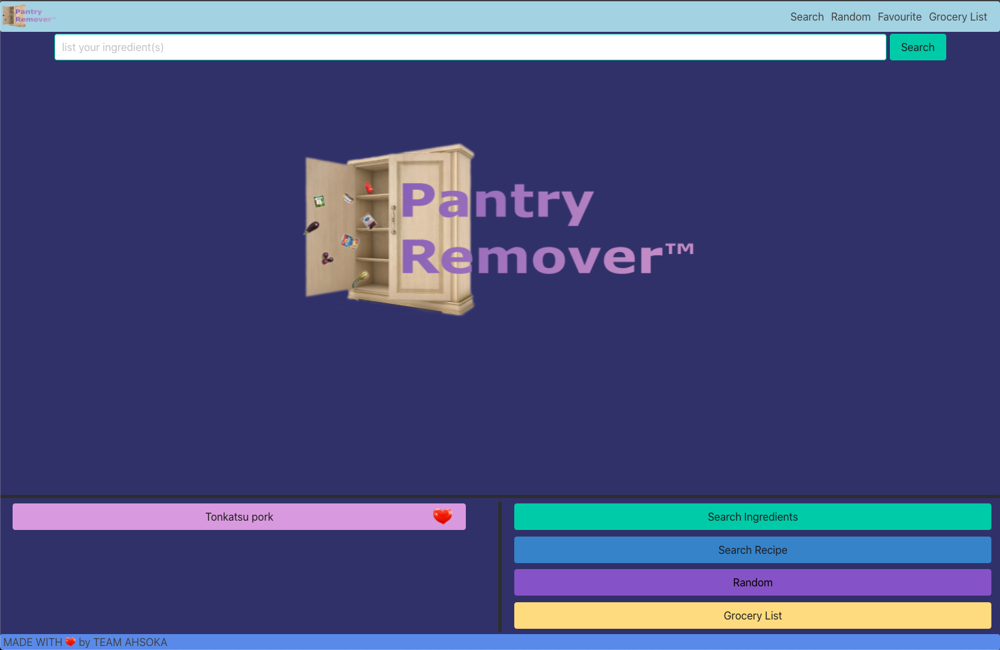
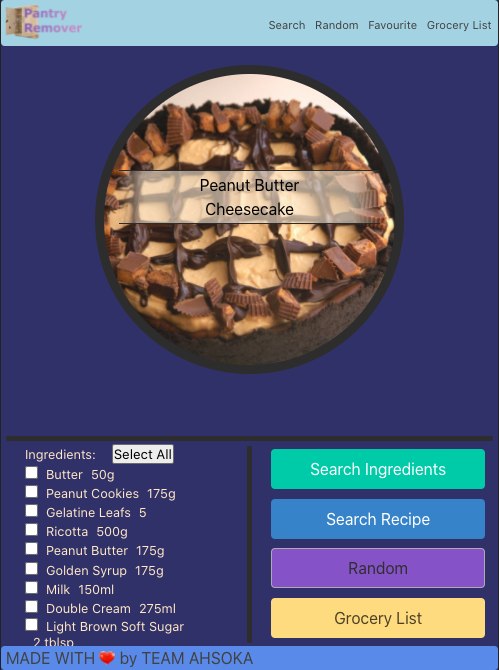

# Pantry Remover

Search for recipes based on available ingredients and easily build a shopping list for the ingredients you lack.

Created by Team Ahsoka ( Dave Quinn, Makda Girmay, Lamek Ghebremicael and Rob Gibson ) Sept 28 , 2021 - Oct 10 , 2021

View the [deployed project](https://qcent.github.io/pantry-remover/)

## Purpose
 To help people use the ingredients currently in their household. / 
 To help people find and save tasty things they can make for themselves. / 
 To help people get the ingredients they will require to do all of the above.  

## User Story
As a hungry person I want to find something to eat

As a person with some ingredients in the cupboard/fridge I want to search for what can be made with them and see a list of recipes

If I still need ingredients to complete a meal I want to easily be able to make a shopping list

As a person who goes shopping I want an interactive list i can use to help me keep track of what i need to buy

## Technologies 
This single page web site features dynamically updated content created through JQuery and powered by 3rd Party Server Side APIs.
The project employs the following technologies.
   * HTML - Page framework with named anatomy for DOM manipulation
   * CSS - Styling and positioning of elements for different screen sizes
   * Bulma - A CSS Framework providing aethsetically pleasing Modal and Form Inputs
   * Javascript - Page logic and simple DOM parsing
   * Jquery - For more advanced DOM manipulation and element creation
   * APIs
      *  https://rapidapi.com/thecocktaildb/api/themealdb/  -  For meal and ingredient searches
      *  https://rapidapi.com/thecocktaildb/api/the-cocktail-db/ - Drinks/Cocktail recipies

## License
`pantry-remover` is Copyright 2021 Team Ahsoka.

`pantry-remover` is licensed under the [MIT License](https://opensource.org/licenses/MIT).

Copyright 2021 Team Ahsoka

Permission is hereby granted, free of charge, to any person obtaining a copy of this software and associated documentation files (the "Software"), to deal in the Software without restriction, including without limitation the rights to use, copy, modify, merge, publish, distribute, sublicense, and/or sell copies of the Software, and to permit persons to whom the Software is furnished to do so, subject to the following conditions:

The above copyright notice and this permission notice shall be included in all copies or substantial portions of the Software.

THE SOFTWARE IS PROVIDED "AS IS", WITHOUT WARRANTY OF ANY KIND, EXPRESS OR IMPLIED, INCLUDING BUT NOT LIMITED TO THE WARRANTIES OF MERCHANTABILITY, FITNESS FOR A PARTICULAR PURPOSE AND NONINFRINGEMENT. IN NO EVENT SHALL THE AUTHORS OR COPYRIGHT HOLDERS BE LIABLE FOR ANY CLAIM, DAMAGES OR OTHER LIABILITY, WHETHER IN AN ACTION OF CONTRACT, TORT OR OTHERWISE, ARISING FROM, OUT OF OR IN CONNECTION WITH THE SOFTWARE OR THE USE OR OTHER DEALINGS IN THE SOFTWARE.
